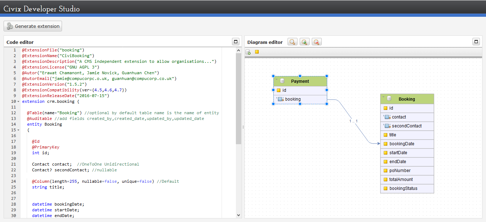

Civix Developer Studio
==================================================
**Civix Developer Studio** is generator that creates everything you need to 
get started with extension development in CiviCRM. Is a nice way to speed
up development by creating boiler-plate code based on DSL.
A developer describes an extension in a high-level, mostly declarative
language, from which code is generated. You can also use a visual designer.

  
It can generate a full extension with fully working CRUD operations,
including Routes, APIs, Controllers, Actions, Repositories,Hooks
, Entities, Migrations, Documentation... and much more)

**For development:**

- Install [qooxdoo](http://www.qooxdoo.org/5.0.2/pages/tool/sdk/sdk_requirements.html#installation-and-setup)
- Clone this repository and copy to any web server
- Update **QOOXDOO_PATH** in config.json
- Exec generate.py
- Open in browser

